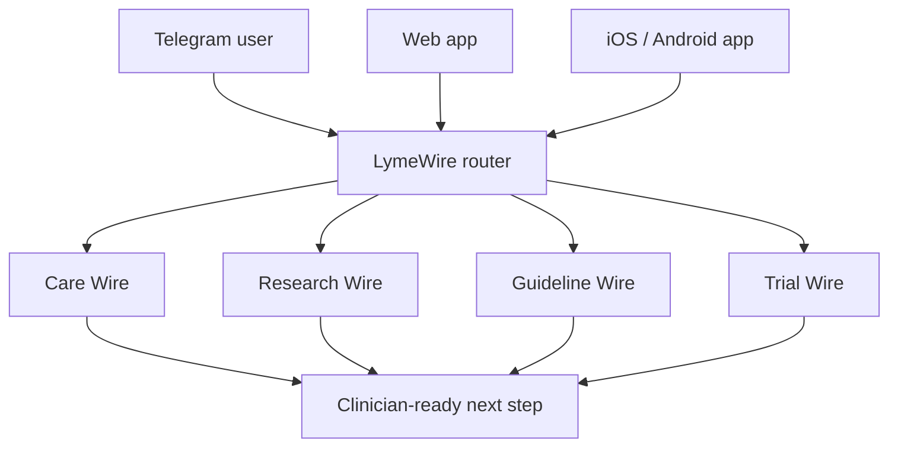

# LymeWire Architecture

## Vision

LymeWire is an evidence and care-navigation network for Lyme disease, PTLDS, and tick-borne illness research.

The product is organized as connected "wires": each wire is a focused access path that turns scattered medical information into something a patient, clinician, or researcher can actually use.

## Public Brand

- Product name: LymeWire
- Primary interface: Telegram bot
- Future interface: web app / knowledge network
- Safety stance: no diagnosis, no prescribing, no fake certainty
- Quality stance: evidence before opinion, source traceability, patient dignity, clinician usefulness

## Network Wires

### Care Wire

Treatment, doctor, hospital, and center navigation. It does not invent doctor rankings or success rates. It helps users build a credible route: local academic care, second opinions, guideline-backed treatment, uncertainty, red flags, and scam filters.

Telegram command: `/care`

### Research Wire

PubMed search, paper analysis, evidence mapping, and "what to read next" summaries.

Telegram commands: `/paper`, `/research`

### Treatment Wire

Treatment-claim review. It separates guideline-backed care, uncertain or experimental approaches, adverse-event risk, and questions for a clinician.

Telegram command: `/treatment`

### Guideline Wire

Official-source and guideline summaries for CDC, NICE, IDSA/AAN/ACR, ILADS, and related sources.

Telegram commands: `/guideline`, `/compare`

### Trial Wire

ClinicalTrials.gov study discovery, study status, intervention snapshots, and eligibility caveats.

Telegram command: `/trial`

### Doctor Brief Wire

Patient-to-clinician translation: timeline, dominant symptoms, prior treatment, test history, questions, and urgency flags.

Telegram command: `/doctorbrief`

### Calm Wire

Low-alarm support for fear, panic, and uncertainty. It validates distress, screens for immediate red flags, and gives one grounding action plus one practical next step.

Telegram command: `/calm`

## Access Model

## Product API

The product API is the shared surface that turns LymeWire from a Telegram-only bot into a multi-interface product.

- `main.py` exposes FastAPI endpoints.
- `core/product.py` owns the first shared wire router.
- Mobile and web call `POST /ask` with a `wire` value instead of relying on Telegram slash commands.
- Timeline data remains local-first until account, consent, encryption, deletion/export, and legal review are designed.

Near-term split:

- Telegram remains the live MVP surface.
- Mobile is the first cross-platform app shell.
- The Product API becomes the shared brain for Telegram, web, iOS, and Android.

## Roadmap

1. Telegram MVP with practical wire commands.
2. Evidence retrieval and source cards.
3. Product API with wire-aware `/ask`, `/brief`, and local-first timeline schema.
4. Knowledge base and `/ask` retrieval over curated Lyme sources.
5. Live care-finder web search for doctors, centers, appointment pages, and international second-opinion routes.
6. User-owned symptom timeline and doctor brief export.
7. Web app where all wires are visible as the LymeWire network.
